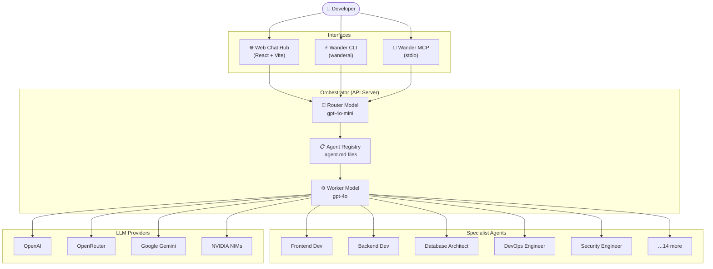

<div align="center">

# 🤖 Wander AI Auto Dev Config

### *Your Local AI Agency. One registry, every specialist, zero context-switching.*

[](https://github.com/wandertechuniverse/WanderAIAutoDevConfig)
[](LICENSE)
[](https://github.com/wandertechuniverse/WanderAIAutoDevConfig/releases)
[](https://nodejs.org)
[](https://react.dev)
[](https://modelcontextprotocol.io)
[](https://openai.com)

</div>

---

## 🧭 The Problem

Modern "vibe coding" workflows are broken. You open a chat window, paste half your codebase for context, get a response, switch to your IDE, realize the AI missed a constraint, paste everything again — and repeat. You are not in flow. You are a human copy-paste machine.

The deeper issue: generic AI assistants know a little about everything. Production software demands a lot about something — a database architect who knows your ORM, a security engineer who has read your threat model, a DevOps specialist who knows your deployment target.

## 💡 The Solution

**Wander AI Auto Dev Config** is a locally-orchestrated, multi-agent AI ecosystem designed for IDE-first development workflows. It ships as a unified agent registry — a single directory of `.agent.md` persona files — accessible through three complementary interfaces:

| Interface | When to use |
|---|---|
| **Web Chat Hub** | Browser-based sessions, documentation, team onboarding |
| **Wander CLI** | Terminal-first tasks, scripts, CI pipelines |
| **Wander MCP** | AI-native IDEs (Cursor, Windsurf, Claude Desktop) |

Every request passes through a two-step pipeline: a fast router model reads your task and the agent registry, selects the best specialist, then hands off to a capable worker model running that agent's full persona. The right expert, every time, automatically.

> Built to empower the transition from **FlutterFlow Student Ambassadors Ghana** to **DevKreate Labs** — where students stop vibe-coding and start shipping.

---

## 🏗️ Core Ecosystem

### 🌐 Wander Web Hub
A glassmorphism dark-mode React interface for direct conversation with any of the 17 specialized agents. Includes a full interactive documentation hub covering CLI setup, MCP integration for every major IDE, and a Repo Context guide for embedding the agent registry into your own project's `.cursorrules`.

### ⚡ Wander CLI (`wanderai`)
A Node.js CLI binary that gives you streaming agent responses directly in your terminal — no browser required. Install once globally, use everywhere. Auto-routes every message to the right specialist via the same router/worker pipeline as the Web Hub.

```bash
wanderai "Audit my Express middleware for injection vulnerabilities"
# → Routes to: security_engineer
```

### 🔌 Wander MCP (`wanderai-mcp`)
A native [Model Context Protocol](https://modelcontextprotocol.io) server that lets Cursor, Windsurf, Claude Desktop, and any MCP-compatible host delegate tasks directly to your local agent registry. Your IDE becomes the interface; Wander AI becomes the team.

---

## 🔀 Interactive Architecture



---

## 🚀 Detailed Setup — The Local-First Way

### Prerequisites

| Tool | Minimum Version | Install |
|---|---|---|
| Node.js | 20.x LTS | [nodejs.org](https://nodejs.org) |
| pnpm | 8.x | `npm install -g pnpm` |
| Bun *(optional, faster CLI dev)* | 1.x | [bun.sh](https://bun.sh) |
| Git | Any | [git-scm.com](https://git-scm.com) |

### 1. Clone the Repository

```bash
git clone https://github.com/wandertechuniverse/WanderAIAutoDevConfig.git
cd WanderAIAutoDevConfig
```

### 2. Install the CLI Globally

```bash
cd artifacts/wander-cli
npm install -g .

# Verify
wanderai --version
```

### 3. Configure Environment

Create a `.env` file inside `artifacts/wander-cli/` (and `artifacts/wander-mcp/` for MCP use):

```bash
# Required — your LLM provider key
OPENAI_API_KEY=sk-...

# Optional — switch LLM provider
ACTIVE_PROVIDER=openai          # openai | openrouter | gemini | nvidia

# Optional — override individual models
WANDER_ROUTER_MODEL=gpt-4o-mini
WANDER_WORKER_MODEL=gpt-4o
WANDER_DATA_DIR=/path/to/data
```

> **Pro-Tip:** The Web Chat Hub uses Replit's internal AI Integration proxy — no `OPENAI_API_KEY` is needed when running inside Replit. Only the CLI and MCP server, which run locally outside of Replit, require a direct key.

### 4. Run the Web Hub (Replit)

The monorepo is pre-configured for Replit. All three services start automatically via the configured workflows. Click **Run** to start, or **Publish** to deploy to a `.replit.app` domain.

### 5. Connect the MCP Server to Your IDE

#### Build the server

```bash
cd artifacts/wander-mcp
pnpm install
pnpm run build
# Output: dist/index.js
```

#### Cursor / Windsurf — `mcp.json`

```json
{
  "mcpServers": {
    "wanderai": {
      "command": "node",
      "args": ["/absolute/path/to/WanderAIAutoDevConfig/artifacts/wander-mcp/dist/index.js"],
      "env": {
        "OPENAI_API_KEY": "sk-..."
      }
    }
  }
}
```

#### Claude Desktop — `claude_desktop_config.json`

```json
{
  "mcpServers": {
    "wanderai": {
      "command": "node",
      "args": ["/absolute/path/to/WanderAIAutoDevConfig/artifacts/wander-mcp/dist/index.js"],
      "env": {
        "OPENAI_API_KEY": "sk-..."
      }
    }
  }
}
```

After saving, restart your IDE and invoke any agent:

```
"Use wanderai to review the security of my auth middleware"
→ Routes to: security_engineer

"Use wanderai to write a Flutter screen for a checkout form"
→ Routes to: mobile_dev
```

---

## 🗂️ Repository Structure

```
WanderAIAutoDevConfig/
├── artifacts/
│   ├── api-server/           # Express API — agent routing, streaming, sessions
│   │   └── data/
│   │       ├── agents/       # .agent.md persona files (one per specialist)
│   │       └── agents_config.json
│   ├── wander-ai/            # React + Vite Web Chat Hub
│   ├── wander-cli/           # Node.js global CLI binary (wanderai)
│   └── wander-mcp/           # MCP server (stdio transport)
├── lib/                      # Shared TypeScript libraries
├── scripts/                  # Utility scripts
├── pnpm-workspace.yaml
└── README.md
```

---

## 🤖 Agent Roster

The registry ships with 17 specialist agents across three tiers:

| # | Agent | Type | Specialisation |
|---|---|---|---|
| 1 | 🏛️ Engineering Manager | Leader | Orchestrates the development team and coordinates all specialist agents |
| 2 | 📋 Product Manager | Leader | Product requirements, user stories, and feature prioritisation |
| 3 | 🔧 Tech Lead | Leader | Architectural decisions and technical approach reviews |
| 4 | 💻 Frontend Developer | Worker | React, TypeScript, UI components, Vite, Tailwind CSS |
| 5 | 📱 Mobile Developer | Worker | Flutter, Dart, Riverpod — cross-platform iOS & Android |
| 6 | ⚙️ Backend Developer | Worker | Express, API routes, business logic, server-side systems |
| 7 | 🗄️ Database Engineer | Worker | Schema design, ORM migrations, query optimisation |
| 8 | 🚀 DevOps Engineer | Worker | GitHub Actions, Docker, VPS, Vercel config, CI/CD automation |
| 9 | 🧪 QA Engineer | Worker | Test authoring, bug hunting, software quality assurance |
| 10 | 🔒 Security Engineer | Worker | Vulnerability audits, OWASP, security best practices |
| 11 | 🎨 UI/UX Designer | Worker | Interface design, user flows, accessibility |
| 12 | 📊 Data Scientist | Worker | ML models, data analysis, insight generation |
| 13 | ✍️ Technical Writer | Subagent | Markdown docs, API references, READMEs, Mermaid.js diagrams |
| 14 | 👀 Code Reviewer | Worker | PR reviews, quality, correctness, consistency |
| 15 | 🔗 API Designer | Worker | REST & GraphQL APIs, OpenAPI spec, contract-first design |
| 16 | ⚡ Performance Engineer | Worker | Profiling, bottleneck analysis, optimisation |
| 17 | 🏗️ Database Architect | Subagent | PostgreSQL design, Supabase RLS, Drizzle/Prisma migrations |

> **Pro-Tip:** Adding a new specialist is one file — drop a `.agent.md` persona file into `artifacts/api-server/data/agents/` and add an entry to `agents_config.json`. The router picks it up immediately with no restart required.

---

## 🔐 Security & Privacy

Wander AI is built on a **local-first, zero-trust** philosophy:

- **API keys stay local.** Your `OPENAI_API_KEY` (or any provider key) lives in a `.env` file on your machine — `artifacts/wander-cli/.env` and `artifacts/wander-mcp/.env`. They are never transmitted to Wander AI servers.
- **Code execution is local.** The CLI and MCP server run as Node.js processes on your hardware. No code is sent to third-party cloud functions.
- **No telemetry.** Wander AI does not collect usage metrics, error reports, or conversation logs.
- **Prompt isolation.** Each agent session is scoped to the active conversation. Agent personas are plain Markdown files you can read, audit, and modify at any time.
- **`.env` files are git-ignored.** The repository is pre-configured to exclude all `.env` files from version control.

> Your setup on your HP EliteBook x360 (or any local machine) is the only place your keys and code ever live.

---

## 🗺️ Roadmap

| Status | Feature |
|---|---|
| ✅ | Web Chat Hub with glassmorphism UI |
| ✅ | Wander CLI with streaming responses |
| ✅ | MCP Server (Cursor, Windsurf, Claude Desktop) |
| ✅ | 17-agent specialist registry |
| ✅ | Interactive Documentation Hub with hash navigation |
| 🔄 | Community Prompt Library — shareable `.agent.md` packs |
| 🔄 | Agent memory — persistent context across sessions |
| 🔄 | Multi-agent task chains — Tech Lead delegates to sub-specialists |
| 🔄 | Local model support — Ollama / LM Studio integration |
| 🔄 | DevKreate Labs onboarding templates |

---

## 🤝 Contributing

Contributions from the **DevKreate Labs** community and beyond are welcome.

```bash
# Fork the repo, then:
git checkout -b feat/my-new-agent
# Add your .agent.md file and agents_config.json entry
git commit -m "feat: add <agent-name> specialist"
git push origin feat/my-new-agent
# Open a Pull Request
```

**Ideas for contribution:**
- New specialist agent personas (`.agent.md` files)
- Provider integrations (Anthropic Claude direct, Mistral, Cohere)
- Community prompt packs for specific stacks (Laravel, Django, Svelte)
- Localisation of the Web Hub UI

---

## 📄 License

MIT © [WanderTech Universe](https://github.com/wandertechuniverse)

---

<div align="center">

**Built with intention. Deployed with precision. Shared with the community.**

*WanderTech Universe · DevKreate Labs · FlutterFlow Student Ambassadors Ghana*

</div>
