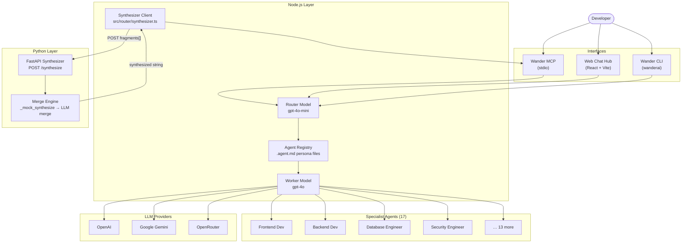

<div align="center">

# Wander AI Auto Dev Config

### *Local-first. Multi-agent. Python-synthesized.*
### *One registry, every specialist, zero context-switching.*

[](LICENSE)
[](https://github.com/wandertechuniverse/WanderAIAutoDevConfig/releases)
[](https://nodejs.org)
[](https://python.org)
[](https://modelcontextprotocol.io)
[](https://fastapi.tiangolo.com)

</div>

---

**Wander AI Auto Dev Config** is a locally-orchestrated, multi-agent AI system built for IDE-first developer workflows. It runs a **Node.js MCP server** that acts as an intelligent traffic cop — routing every incoming task from your IDE to the right specialist agent — and a **Python FastAPI microservice** that acts as the synthesis brain, merging the raw outputs of multiple agents into a single, unified code artifact before it ever reaches your editor.

No cloud orchestration. No vendor lock-in. Your keys stay on your machine.

---

## The Problem

Modern "vibe coding" workflows are broken. You open a chat window, paste half your codebase for context, get a response, switch back to your IDE, realise the AI missed a constraint, paste everything again — and repeat. You are not in flow. You are a human copy-paste machine.

The deeper issue: generic AI assistants know a little about everything. Production software demands a lot about something — a database architect who knows your ORM, a security engineer who has read your threat model, a DevOps specialist who knows your deployment target.

---

## The Solution: Node Traffic Cop + Python Brain

Wander AI solves this with a two-layer enterprise architecture:

| Layer | Runtime | Role |
|---|---|---|
| **MCP Router** | Node.js (TypeScript) | Receives IDE requests, routes to the right specialist agent via a fast router model, coordinates parallel agent execution |
| **Synthesizer** | Python (FastAPI) | Receives raw outputs from multiple agents, merges and validates them into a single unified artifact, returns it to Node |

The IDE talks exclusively to the Node MCP server. Node talks to the Python synthesizer. The result flows back to your cursor as clean, production-ready code — sourced from the right specialist, merged by an intelligent synthesis engine.

```
IDE (Cursor / Windsurf / Claude Desktop)
  │
  │  MCP stdio
  ▼
Node.js MCP Router  ──────────────────────────────────┐
  │  routes task to specialist agents                  │
  ├── Database Engineer  ──┐                           │
  └── Frontend Developer ──┤ raw fragments             │
                           ▼                           │
                   Python Synthesizer                  │
                   POST /synthesize                    │
                   merges + validates                  │
                           │                           │
                           └──── unified artifact ─────┘
                                         │
                                         ▼
                               IDE receives result
```

The synthesis layer is intentionally decoupled so it can be upgraded independently — swap the mock concatenation logic for an LLM-merge, AST-aware merge, or semantic diff without touching a single line of the Node router.

---

## Architecture Overview



---

## Prerequisites

| Tool | Minimum Version | Install |
|---|---|---|
| Node.js | **20.x LTS** | [nodejs.org](https://nodejs.org) |
| Python | **3.10+** | [python.org](https://python.org) |
| pnpm | 8.x | `npm install -g pnpm` |
| An MCP-compatible IDE | — | [Cursor](https://cursor.com), [Windsurf](https://windsurf.ai), or [Claude Desktop](https://claude.ai/download) |

---

## Installation & Boot Sequence

### 1. Clone

```bash
git clone https://github.com/wandertechuniverse/WanderAIAutoDevConfig.git
cd WanderAIAutoDevConfig
```

### 2. Install Node dependencies

```bash
# Install all workspace packages from the monorepo root
npm install

# Or with pnpm (preferred):
pnpm install
```

### 3. Install Python dependencies

```bash
cd synthesizer
pip install -r requirements.txt
cd ..
```

> On some systems you may need `pip3` instead of `pip`. If `pip` is not found, try `python3 -m pip install -r requirements.txt`.

### 4. Boot the Python Synthesizer backend

The synthesizer must be running before the MCP server serves any `synthesize_multi_agent` calls.

```bash
cd synthesizer
uvicorn main:app --host 0.0.0.0 --port 8000 --reload
```

You should see:

```
INFO:     Uvicorn running on http://0.0.0.0:8000
INFO:     Application startup complete.
```

Verify it is live:

```bash
curl http://localhost:8000/healthz
# → {"status":"ok","service":"wander-synthesizer"}
```

### 5. Build and connect the MCP server

```bash
cd artifacts/wander-mcp
pnpm install
pnpm run build
# Output: dist/index.js
```

#### Cursor / Windsurf — `.cursor/mcp.json` or `mcp.json`

```json
{
  "mcpServers": {
    "wanderai": {
      "command": "node",
      "args": ["/absolute/path/to/WanderAIAutoDevConfig/artifacts/wander-mcp/dist/index.js"],
      "env": {
        "OPENAI_API_KEY": "sk-..."
      }
    }
  }
}
```

#### Claude Desktop — `claude_desktop_config.json`

```json
{
  "mcpServers": {
    "wanderai": {
      "command": "node",
      "args": ["/absolute/path/to/WanderAIAutoDevConfig/artifacts/wander-mcp/dist/index.js"],
      "env": {
        "OPENAI_API_KEY": "sk-..."
      }
    }
  }
}
```

After saving, restart your IDE. The following tools will be available:

| Tool | What it does |
|---|---|
| `delegate_to_wander_ai` | Auto-routes your task to the best specialist agent |
| `ask_specific_agent` | Sends a task directly to a named agent by ID |
| `list_wander_agents` | Lists all 17 agents with their IDs and roles |
| `synthesize_multi_agent` | Runs a Database Agent + UI Agent in parallel and pipes their outputs through the Python synthesizer |

### 6. Install the CLI globally (optional)

```bash
cd artifacts/wander-cli
npm install -g .

# Verify
wanderai --version

# Use
wanderai "Audit my Express middleware for injection vulnerabilities"
# → Routes to: security_engineer
```

---

## Environment Variables

Create a `.env` file in `artifacts/wander-cli/` (for CLI use) and pass the same keys via the MCP config `env` block (for IDE use). You need **at least one** provider key.

```bash
# ── LLM Provider keys — set at least one ─────────────────────────────────────

# OpenAI — gives access to gpt-4o, gpt-4o-mini, o1, etc.
OPENAI_API_KEY=sk-...

# Google Gemini — gives access to gemini-1.5-pro, gemini-2.0-flash, etc.
GEMINI_API_KEY=AIza...

# OpenRouter — single key for 200+ models (OpenAI, Anthropic, Mistral, etc.)
# Recommended if you want model flexibility without managing multiple keys.
OPENROUTER_API_KEY=sk-or-...

# ── Provider selection ────────────────────────────────────────────────────────
# auto (default): uses OpenAI if OPENAI_API_KEY is set, falls back to Gemini
# openai:         force OpenAI — OPENAI_API_KEY must be present
# gemini:         force Gemini — GEMINI_API_KEY must be present
WANDERAI_PROVIDER=auto

# ── Model overrides (optional) ────────────────────────────────────────────────
WANDER_ROUTER_MODEL=gpt-4o-mini    # Fast model for task routing (low cost)
WANDER_WORKER_MODEL=gpt-4o         # Capable model for agent execution

# ── Synthesizer URL (optional) ────────────────────────────────────────────────
# Override if your Python synthesizer runs on a different host or port.
WANDER_SYNTHESIZER_URL=http://localhost:8000/synthesize

# ── Custom data directory (optional) ─────────────────────────────────────────
# Path to agents_config.json and the agents/ persona directory.
WANDER_DATA_DIR=/path/to/data
```

**Provider priority for the CLI:**

1. `--provider openai` flag → requires `OPENAI_API_KEY`
2. `--provider gemini` flag → requires `GEMINI_API_KEY`
3. `--provider auto` (default) → OpenAI if available, Gemini as fallback
4. Auto-fallback: if an OpenAI call fails with a rate-limit or safety block and `GEMINI_API_KEY` is set, the CLI silently retries via Gemini

> **Global key setup (recommended):** Add your key to `~/.bashrc` or `~/.zshrc` so `wanderai` works in any directory without a `.env` file:
> ```bash
> export OPENAI_API_KEY="sk-..."
> source ~/.bashrc
> ```

---

## Repository Structure

```
WanderAIAutoDevConfig/
├── artifacts/
│   ├── api-server/               # Express API — agent routing, streaming, sessions
│   │   └── data/
│   │       ├── agents/           # .agent.md persona files (one per specialist)
│   │       └── agents_config.json
│   ├── wander-ai/                # React + Vite Web Chat Hub + /docs hub
│   ├── wander-cli/               # Node.js global CLI binary (wanderai)
│   │   ├── bin/cli.js            # UI orchestration layer
│   │   └── src/
│   │       ├── config/validator.js   # Zod validation for env + agents_config
│   │       ├── core/agents.js        # Path resolution + agent loading
│   │       ├── core/providers.js     # OpenAI + Gemini client factories
│   │       └── utils/logger.js       # Chalk-based structured logger
│   └── wander-mcp/               # MCP server (stdio transport, TypeScript)
│       └── src/
│           ├── index.ts              # MCP tools + orchestrator logic
│           └── router/
│               └── synthesizer.ts   # Node→Python bridge client
├── synthesizer/                  # Python FastAPI synthesis microservice
│   ├── main.py                   # POST /synthesize + GET /healthz
│   └── requirements.txt
├── lib/                          # Shared TypeScript libraries
├── scripts/                      # Utility scripts
├── pnpm-workspace.yaml
└── README.md
```

---

## Agent Roster

The registry ships with 17 specialist agents across three tiers:

| # | Agent | Type | Specialisation |
|---|---|---|---|
| 1 | Engineering Manager | Leader | Orchestrates the development team and coordinates all specialist agents |
| 2 | Product Manager | Leader | Product requirements, user stories, and feature prioritisation |
| 3 | Tech Lead | Leader | Architectural decisions and technical approach reviews |
| 4 | Frontend Developer | Worker | React, TypeScript, UI components, Vite, Tailwind CSS |
| 5 | Mobile Developer | Worker | Flutter, Dart, Riverpod — cross-platform iOS & Android |
| 6 | Backend Developer | Worker | Express, API routes, business logic, server-side systems |
| 7 | Database Engineer | Worker | Schema design, ORM migrations, query optimisation |
| 8 | DevOps Engineer | Worker | GitHub Actions, Docker, VPS, Vercel config, CI/CD automation |
| 9 | QA Engineer | Worker | Test authoring, bug hunting, software quality assurance |
| 10 | Security Engineer | Worker | Vulnerability audits, OWASP, security best practices |
| 11 | UI/UX Designer | Worker | Interface design, user flows, accessibility |
| 12 | Data Scientist | Worker | ML models, data analysis, insight generation |
| 13 | Technical Writer | Subagent | Markdown docs, API references, READMEs, Mermaid.js diagrams |
| 14 | Code Reviewer | Worker | PR reviews, quality, correctness, consistency |
| 15 | API Designer | Worker | REST & GraphQL APIs, OpenAPI spec, contract-first design |
| 16 | Performance Engineer | Worker | Profiling, bottleneck analysis, optimisation |
| 17 | Database Architect | Subagent | PostgreSQL design, Supabase RLS, Drizzle/Prisma migrations |

> Adding a new specialist is one file — drop a `.agent.md` persona into `artifacts/api-server/data/agents/` and add an entry to `agents_config.json`. The router picks it up immediately with no restart required.

---

## Synthesizer API Reference

The Python microservice exposes two endpoints:

### `GET /healthz`

Liveness probe. Returns `200 OK` when the service is up.

```json
{ "status": "ok", "service": "wander-synthesizer" }
```

### `POST /synthesize`

Merges an array of raw agent output fragments into a single unified string.

**Request**

```json
{
  "fragments": [
    "// [Database Agent]\nCREATE TABLE tasks (...);",
    "// [UI Agent]\nexport function TaskCard() { ... }"
  ],
  "metadata": { "session_id": "abc123", "agent_ids": ["database_engineer", "frontend_dev"] }
}
```

**Response**

```json
{
  "synthesized": "// ✦  WanderAI Synthesized Output  —  2 fragment(s)\n...",
  "fragment_count": 2,
  "synthesized_at": "2026-05-03T14:24:55.128589+00:00",
  "strategy": "mock-concatenate-v1"
}
```

The `strategy` field is the upgrade point — swap `_mock_synthesize` in `synthesizer/main.py` for any merge implementation (LLM-merge, AST diff, semantic grouping) and this field reflects it automatically.

**Graceful degradation:** If the Python service is offline when the MCP server calls it, the Node synthesizer client (`src/router/synthesizer.ts`) catches the `ECONNREFUSED` error, logs a warning to stderr, and returns a locally-concatenated fallback. The IDE call always succeeds.

---

## Security & Privacy

Wander AI is built on a **local-first, zero-trust** philosophy:

- **API keys stay local.** Your provider keys live in `.env` files on your machine and in your IDE's MCP config. They are never transmitted to Wander AI servers.
- **Code execution is local.** The CLI and MCP server run as Node.js processes on your hardware. The synthesizer runs as a Python process on your hardware. No code is sent to third-party cloud functions.
- **No telemetry.** Wander AI does not collect usage metrics, error reports, or conversation logs.
- **Prompt isolation.** Each agent session is scoped to the active conversation. Agent personas are plain Markdown files you can read, audit, and modify at any time.
- **`.env` files are git-ignored.** The repository is pre-configured to exclude all `.env` files from version control.

---

## Troubleshooting

| Symptom | Fix |
|---|---|
| `API Key Not Set` | Ensure your `.env` file is formatted as `OPENAI_API_KEY=sk-...` with no spaces or quotes around the value |
| `ERR_PNPM_NO_GLOBAL_BIN_DIR` | Run `pnpm setup`, restart terminal, then re-run `npm install -g .` |
| `wanderai: command not found` | Your global Node bin directory is not in `$PATH`. Run `npm bin -g` to find it, then add it to `~/.bashrc` |
| Synthesizer `ECONNREFUSED` | Boot the Python service first: `cd synthesizer && uvicorn main:app --port 8000` |
| MCP tools not appearing | Rebuild: `cd artifacts/wander-mcp && pnpm run build`, then restart your IDE |
| `Cannot find agents_config.json` | Run `wanderai` from the monorepo root, or set `WANDER_DATA_DIR` to the absolute path of `artifacts/api-server/data/` |

---

## Roadmap

| Status | Feature |
|---|---|
| ✅ | Web Chat Hub with glassmorphism UI + `/docs` hub |
| ✅ | Wander CLI with streaming responses + Gemini fallback |
| ✅ | MCP Server (Cursor, Windsurf, Claude Desktop) |
| ✅ | 17-agent specialist registry |
| ✅ | Python FastAPI Synthesizer microservice |
| ✅ | Node→Python bridge with graceful offline fallback |
| ✅ | Enterprise CLI refactor (Zod validation, chalk logger, `src/` layer) |
| 🔄 | LLM-powered merge engine (replace mock concatenation) |
| 🔄 | Agent memory — persistent context across sessions |
| 🔄 | Multi-agent task chains — Tech Lead delegates to sub-specialists |
| 🔄 | Local model support — Ollama / LM Studio integration |
| 🔄 | Community prompt library — shareable `.agent.md` packs |

---

## Contributing

```bash
# Fork the repo, then:
git checkout -b feat/my-new-agent

# Add your .agent.md file and agents_config.json entry
# artifacts/api-server/data/agents/my_agent.agent.md
# artifacts/api-server/data/agents_config.json

git commit -m "feat: add <agent-name> specialist"
git push origin feat/my-new-agent
# Open a Pull Request
```

**Ideas for contribution:**
- New specialist agent personas (`.agent.md` files)
- A real LLM-merge implementation for the Python synthesizer
- Provider integrations (Anthropic Claude direct, Mistral, Cohere)
- Community prompt packs for specific stacks (Laravel, Django, Svelte)

---

## License

MIT © [WanderTech Universe](https://github.com/wandertechuniverse)

---

<div align="center">

**Built with intention. Deployed with precision. Shared with the community.**

*WanderTech Universe*

</div>
